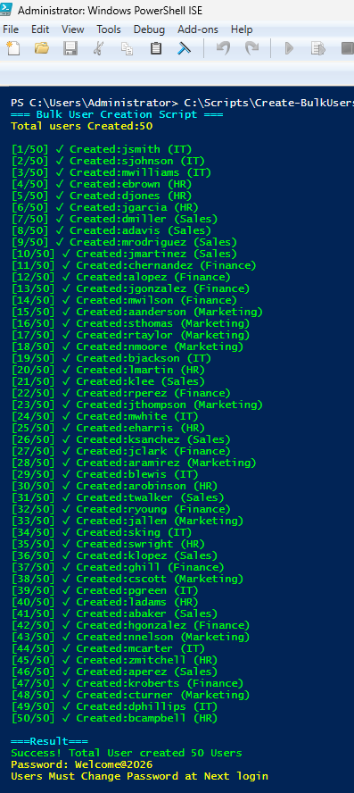
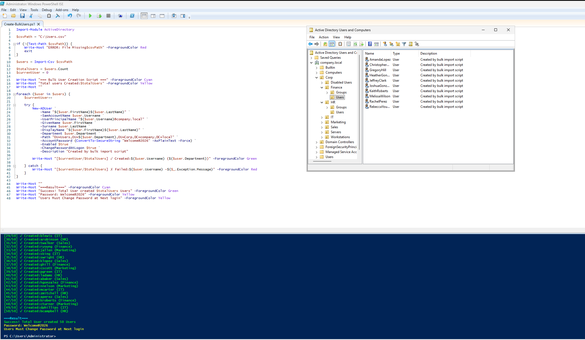

# Lab 2 — Active Directory Bulk User Provisioning with PowerShell

A real-world IT Support automation project: bulk-provisioning 50 Active Directory user accounts from a CSV file, distributed across 5 organizational units, with auto-assigned departments, forced password reset on first logon, and full error handling.

## Objective

Solve a common IT Support pain point: HR sends a list of new hires, and IT must create dozens of AD accounts manually — slow, error-prone, and inconsistent. This lab automates the entire process end-to-end:

- Bulk user creation from a CSV input (HR-friendly format)
- Automatic OU placement based on department
- Standardized account settings (password policy, UPN, display name)
- Error handling and progress reporting
- Repeatable, auditable, and scalable

## Architecture

### Infrastructure

| Component | Role | IP Address | OS |
|-----------|------|------------|-----|
| DC01 | Domain Controller, DNS | 192.168.50.10 | Windows Server 2022 |

### Domain Structure

Forest: **company.local** | NetBIOS: **COMPANY**

```
corp.local
└── Corp
    ├── Finance   (10 Users)
    ├── HR        (10 Users)
    ├── IT        (10 Users)
    ├── Marketing (10 Users)
    ├── Sales     (10 Users)
    ├── Disabled Users
    ├── Servers
    └── Workstations
```


## Input Data — HR-Friendly CSV

The script accepts a simple CSV that any HR admin can prepare in Excel:

```csv
FirstName,LastName,Username,Department
John,Smith,jsmith,IT
Sarah,Johnson,sjohnson,IT
Emily,Brown,ebrown,HR
Daniel,Miller,dmiller,Sales
...
```

**Total: 50 users** distributed evenly across 5 departments.


## The Automation Script

`Create-BulkUsers.ps1` performs the following for each row in the CSV:

| Step | Action |
|------|--------|
| 1 | Validate CSV file exists |
| 2 | Loop through each user record |
| 3 | Build full DN path based on department |
| 4 | Create AD user with `New-ADUser` |
| 5 | Set standard password (`Welcome@2026`) |
| 6 | Force password change at next logon |
| 7 | Enable account immediately |
| 8 | Log success/failure with color-coded output |

### Key Features

- **Idempotent error handling** — if one user fails, the rest still process
- **Progress indicator** — `[15/50] ✓ Created: jsmith (IT)`
- **Department auto-routing** — places user in the correct OU automatically
- **Security baseline** — every account starts with the same temporary password and `ChangePasswordAtLogon = $true`



## Verification

### Users Created Successfully

All 50 users distributed across the 5 department OUs:


### Sample User Properties

`Get-ADUser jsmith -Properties *` confirms:

- ✅ Account enabled
- ✅ Located in `OU=IT,DC=company,DC=local`
- ✅ Department field populated
- ✅ UPN set to `jsmith@company.local`
- ✅ Password change required at next logon



## Troubleshooting — Real Issues Solved

### 1. CSV encoding broke special characters

**Symptom:** Users with Thai names or special characters showed as `???` in AD.

**Root cause:** `Import-Csv` defaults to ASCII encoding on older PowerShell versions.

**Fix:**

```powershell
$users = Import-Csv $csvPath -Encoding UTF8
```

**Lesson:** Always specify `-Encoding UTF8` when reading CSV files containing non-ASCII characters.

### 2. "The object already exists" error stopped the whole batch

**Symptom:** Re-running the script after partial completion threw an exception and halted execution.

**Root cause:** No try/catch block — a single duplicate username crashed the entire loop.

**Fix:** Wrapped `New-ADUser` in `try/catch` so duplicates are logged and skipped:

```powershell
try {
    New-ADUser ...
    Write-Host "[$current/$total] ✓ Created: $($user.Username)" -ForegroundColor Green
} catch {
    Write-Host "[$current/$total] ✗ Failed: $($user.Username) - $($_.Exception.Message)" -ForegroundColor Red
}
```

**Lesson:** Bulk operations must NEVER stop on a single failure. Log and continue.

### 3. Password complexity rejection

**Symptom:** Some test runs failed with "The password does not meet the password policy requirements."

**Root cause:** The default domain password policy required 8+ characters with complexity. Initial test password was too simple.

**Fix:** Used `Welcome@2026` which meets all complexity rules (uppercase, lowercase, number, symbol, ≥8 chars).

**Lesson:** Always test bulk scripts against the actual domain password policy before production use.

### 4. Users created but couldn't log in

**Symptom:** AD account existed but PC01 rejected login.

**Root cause:** Forgot `-Enabled $true` parameter — accounts were created in disabled state.

**Fix:** Added `-Enabled $true` to the `New-ADUser` call.

**Lesson:** `New-ADUser` creates **disabled** accounts by default. Always explicitly enable, or run `Enable-ADAccount` afterward.

## Business Value

| Metric | Before (Manual) | After (Automated) | Improvement |
|--------|-----------------|-------------------|-------------|
| Time per user | ~5 minutes | ~2 seconds | **150× faster** |
| 50-user onboarding | ~4 hours | ~2 minutes | **120× faster** |
| Human error rate | High | Near zero | Standardized |
| Audit trail | Manual notes | Console + log | Built-in |

**Real-world scenario:** New hire batch from HR → drop CSV in folder → run script → all accounts ready in under 2 minutes.

## Tech Stack

- **OS:** Windows Server 2022 Evaluation
- **Hypervisor:** VirtualBox
- **Scripting:** PowerShell 5.1
- **Module:** ActiveDirectory (RSAT)
- **Input format:** CSV (Excel-compatible)

## What I Learned

- PowerShell scripting fundamentals: parameters, loops, error handling, output formatting
- Active Directory cmdlets (`New-ADUser`, `Get-ADUser`, `Set-ADAccountPassword`)
- Distinguished Name (DN) syntax and how OUs map to LDAP paths
- The importance of idempotency in automation scripts
- CSV as a universal HR-to-IT data exchange format
- Why `-Enabled $true` and `-ChangePasswordAtLogon $true` are security best practices

## Files in This Lab

| File | Purpose |
|------|---------|
| `Create-BulkUsers.ps1` | Main automation script |
| `Users.csv` | Sample input (50 users) |
| `screenshots/` | Verification evidence |
<<<<<<< HEAD
| `README.md` | This document |
=======
| `README.md` | This document |

---

Built as part of my IT Support portfolio — Lab 2 of 10. See the [main portfolio](../README.md) for related labs (GPO, Password Reset Tool, Security Audit, Backup Automation, and more).
>>>>>>> 0df432dd02e1bb9528c4eb1cd0abb551a75017da
